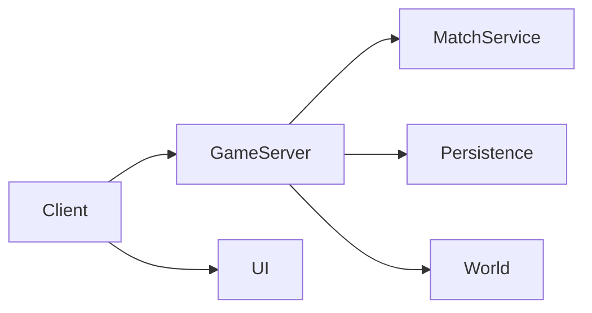

# Game Documentation Vault — Obsidian

Este repositório é o **cofre de documentação do jogo**.

A função deste README é orientar o Claude sobre **como analisar o projeto e separar todas as informações encontradas em notas do Obsidian**.

> **Importante:** o Claude deve preencher e atualizar a documentação a partir do código, configurações, assets e arquivos do projeto. Este README define a organização; não deve ser usado como espaço para concentrar toda a documentação.

---

## 1. Objetivo

A documentação deve permitir que alguém que nunca viu o projeto consiga entender:

- o conceito geral do jogo;
- as regras e mecânicas;
- os modos de jogo;
- como o jogo é renderizado/desenhado;
- como mapas e cenários são construídos;
- como materiais e texturas são aplicados;
- como personagens, armas, objetos e outros assets funcionam;
- como UI/UX funciona;
- como áudio e efeitos funcionam;
- como cliente e servidor se comunicam;
- como dados, persistência e configuração funcionam;
- como o projeto é executado, publicado e monitorado;
- como os sistemas dependem uns dos outros;
- quais são as limitações, problemas conhecidos e decisões arquiteturais.

A documentação deve privilegiar **entendimento do sistema**, e não apenas repetir o código-fonte.

---

# 2. Estrutura principal do Vault

Use esta estrutura de pastas como padrão:

```text
Game-Vault/
│
├── README.md
├── 00 - Index/
│   ├── Home.md
│   ├── Game Overview.md
│   ├── Architecture Overview.md
│   ├── Systems Map.md
│   ├── Dependencies Map.md
│   └── Documentation Status.md
│
├── 01 - Vision & Design/
│   ├── Game Concept.md
│   ├── Core Pillars.md
│   ├── Core Loop.md
│   ├── Game Rules.md
│   ├── Progression.md
│   ├── Economy Design.md
│   └── Player Experience.md
│
├── 02 - Gameplay & Mechanics/
│   ├── Mechanics Index.md
│   ├── Movement.md
│   ├── Combat.md
│   ├── Weapons.md
│   ├── Damage System.md
│   ├── Health System.md
│   ├── Interaction System.md
│   ├── Inventory.md
│   ├── Items.md
│   ├── Pickups.md
│   ├── Objectives.md
│   ├── Respawn.md
│   ├── Scoring.md
│   └── Other Mechanics/
│
├── 03 - Game Modes/
│   ├── Game Modes Index.md
│   ├── Mode Template.md
│   ├── Team Deathmatch.md
│   ├── Free For All.md
│   ├── Objective Modes.md
│   └── Other Modes/
│
├── 04 - World & Maps/
│   ├── Maps Index.md
│   ├── World Structure.md
│   ├── Map Design Rules.md
│   ├── Level Flow.md
│   ├── Spawn Design.md
│   ├── Cover & Combat Spaces.md
│   ├── Interactive Objects.md
│   └── Maps/
│       ├── Map - <Name>.md
│       └── ...
│
├── 05 - Rendering & Visuals/
│   ├── Rendering Overview.md
│   ├── Camera.md
│   ├── Lighting.md
│   ├── Post Processing.md
│   ├── Shaders.md
│   ├── Materials.md
│   ├── Texture System.md
│   ├── Decals.md
│   ├── Particles.md
│   ├── Visual Effects.md
│   ├── Animation.md
│   └── Performance Rendering.md
│
├── 06 - Art & Assets/
│   ├── Art Direction.md
│   ├── Asset Pipeline.md
│   ├── Characters/
│   ├── Weapons/
│   ├── Props/
│   ├── Environment/
│   ├── Textures/
│   ├── Materials/
│   ├── VFX/
│   ├── UI Assets/
│   └── Reference Images/
│
├── 07 - Audio/
│   ├── Audio Overview.md
│   ├── Music.md
│   ├── SFX.md
│   ├── Voice.md
│   ├── Ambient Audio.md
│   └── Audio Events.md
│
├── 08 - UI & UX/
│   ├── UI Overview.md
│   ├── HUD.md
│   ├── Menus.md
│   ├── Matchmaking UI.md
│   ├── Inventory UI.md
│   ├── Scoreboard.md
│   ├── Notifications.md
│   ├── Input & Controls.md
│   └── UX Flows/
│
├── 09 - Code Architecture/
│   ├── Architecture Overview.md
│   ├── Client Architecture.md
│   ├── Server Architecture.md
│   ├── Shared Systems.md
│   ├── Modules.md
│   ├── Services.md
│   ├── Controllers.md
│   ├── Events & Messaging.md
│   ├── State Management.md
│   ├── Configuration.md
│   ├── Error Handling.md
│   └── Utilities.md
│
├── 10 - Networking & Multiplayer/
│   ├── Networking Overview.md
│   ├── Client Server Model.md
│   ├── Remote Calls.md
│   ├── Replication.md
│   ├── Synchronization.md
│   ├── Matchmaking.md
│   ├── Sessions.md
│   └── Anti Cheat.md
│
├── 11 - Data & Persistence/
│   ├── Data Architecture.md
│   ├── Player Data.md
│   ├── Save System.md
│   ├── Database.md
│   ├── Cache.md
│   ├── Configuration Data.md
│   └── Data Migrations.md
│
├── 12 - AI & NPCs/
│   ├── AI Overview.md
│   ├── NPC Behavior.md
│   ├── Navigation.md
│   ├── States.md
│   └── AI Decisions.md
│
├── 13 - Backend & Services/
│   ├── Backend Overview.md
│   ├── APIs.md
│   ├── Authentication.md
│   ├── Match Services.md
│   ├── External Services.md
│   └── Integrations.md
│
├── 14 - Infrastructure & Deployment/
│   ├── Infrastructure Overview.md
│   ├── Environments.md
│   ├── Local Development.md
│   ├── Build Pipeline.md
│   ├── CI CD.md
│   ├── Hosting.md
│   ├── Monitoring.md
│   ├── Logging.md
│   └── Troubleshooting.md
│
├── 15 - Performance/
│   ├── Performance Overview.md
│   ├── CPU.md
│   ├── GPU.md
│   ├── Memory.md
│   ├── Network Performance.md
│   ├── Loading Performance.md
│   └── Known Bottlenecks.md
│
├── 16 - Security/
│   ├── Security Overview.md
│   ├── Trust Boundaries.md
│   ├── Validation.md
│   ├── Anti Exploit.md
│   └── Sensitive Data.md
│
├── 17 - Testing/
│   ├── Testing Overview.md
│   ├── Unit Tests.md
│   ├── Integration Tests.md
│   ├── Gameplay Tests.md
│   ├── Performance Tests.md
│   └── Test Scenarios/
│
├── 18 - Live Ops/
│   ├── Live Game Structure.md
│   ├── Events.md
│   ├── Updates.md
│   ├── Feature Flags.md
│   ├── Configurable Content.md
│   └── Release Notes/
│
├── 19 - Decisions & Knowledge/
│   ├── Architecture Decisions/
│   ├── Design Decisions/
│   ├── Technical Decisions/
│   ├── Known Problems/
│   ├── Technical Debt.md
│   ├── Alternatives Considered.md
│   └── Lessons Learned.md
│
└── 20 - Reference/
    ├── Glossary.md
    ├── Naming Conventions.md
    ├── File Structure Reference.md
    ├── Constants Reference.md
    ├── Configuration Reference.md
    └── External References.md
```

> **Nota deste cofre:** para que todo link `[[...]]` aponte para uma única nota, a nota `09 - Code Architecture/Architecture Overview.md` se chama **`Code Architecture Overview.md`**. A `00 - Index/Architecture Overview.md` é a visão geral de alto nível.

---

# 3. Regra principal de separação

Cada informação deve ser colocada no **domínio ao qual ela pertence**, mesmo quando o código estiver fisicamente localizado em outro lugar.

Exemplo:

```text
Código:
src/game/combat/WeaponController.ts
```

Esse arquivo pode gerar informações para várias notas:

```text
02 - Gameplay & Mechanics/Combat.md
02 - Gameplay & Mechanics/Weapons.md
09 - Code Architecture/Controllers.md
10 - Networking & Multiplayer/Remote Calls.md
15 - Performance/GPU.md
```

Não criar uma única nota chamada `WeaponController.md` contendo tudo.

A documentação deve separar:

- **o que o sistema faz** → Gameplay / Design;
- **como ele é implementado** → Code Architecture;
- **como ele aparece** → Rendering / Art / VFX;
- **como ele se comunica** → Networking;
- **como é salvo** → Data & Persistence;
- **como é configurado** → Configuration;
- **como é otimizado** → Performance;
- **como é testado** → Testing.

---

# 4. Como o Claude deve analisar o código

O Claude deve seguir esta ordem:

```text
1. Descobrir a estrutura real do projeto
2. Identificar os sistemas principais
3. Identificar os pontos de entrada
4. Identificar dependências entre sistemas
5. Identificar dados/configurações
6. Identificar gameplay e regras
7. Identificar renderização e recursos visuais
8. Identificar multiplayer/rede
9. Identificar persistência
10. Identificar infraestrutura
11. Identificar performance
12. Identificar problemas conhecidos
13. Criar/atualizar as notas do Vault
14. Criar links entre as notas relacionadas
```

Não assumir que uma pasta do código corresponde diretamente a uma pasta da documentação.

A documentação deve ser baseada na **responsabilidade do sistema**, não somente na estrutura física dos arquivos.

---

# 5. O que documentar em cada área

## 5.1 Vision & Design

Documentar a intenção do jogo.

Exemplos:

- proposta;
- gênero;
- experiência desejada;
- público;
- pilares de design;
- loop principal;
- progressão;
- economia;
- regras globais.

Não colocar detalhes de implementação aqui, exceto quando forem necessários para explicar uma regra de design.

---

## 5.2 Gameplay & Mechanics

Documentar **comportamento observável e regras**.

Para cada mecânica relevante, registrar:

```text
Nome
Objetivo
Como o jogador interage
Regras
Estados possíveis
Entradas
Saídas
Dependências
Exceções
Código relacionado
Configurações relacionadas
```

Exemplo:

```text
Combat
├── Damage
├── Hit Detection
├── Weapons
├── Reload
├── Recoil
├── Critical Hits
└── Death / Respawn
```

---

## 5.3 Game Modes

Cada modo de jogo deve ter uma nota própria.

Modelo:

```text
# <Game Mode>

## Objetivo

## Condição de vitória

## Condição de derrota

## Times

## Regras

## Fluxo da partida

## Respawn

## Pontuação

## Limites de tempo

## Configurações

## Sistemas utilizados

## Código relacionado

## UI relacionada
```

Não misturar regras específicas de um modo com regras globais do jogo.

---

## 5.4 World & Maps

Separar documentação de **design do mapa** de documentação de **implementação/renderização**.

Para cada mapa:

```text
Mapa
├── Visão geral
├── Layout
├── Rotas principais
├── Rotas alternativas
├── Áreas abertas
├── Áreas fechadas
├── Cobertura
├── Spawn points
├── Objetivos
├── Zonas especiais
├── Objetos interativos
├── Fluxo esperado dos jogadores
└── Problemas conhecidos
```

Quando houver informações visuais, referenciar também:

```text
05 - Rendering & Visuals
06 - Art & Assets
```

---

## 5.5 Rendering & Visuals

Esta área deve explicar **como o jogo produz a imagem final**.

Documentar, quando existente:

- câmera;
- FOV;
- resolução e escalonamento;
- pipeline de renderização;
- iluminação;
- sombras;
- ambient occlusion;
- materiais;
- shaders;
- pós-processamento;
- partículas;
- decals;
- efeitos especiais;
- animações visuais;
- técnicas de otimização visual.

Também registrar quais sistemas influenciam diretamente o desempenho da GPU.

---

## 5.6 Art & Assets

Documentar **o conteúdo visual**, não o algoritmo que o exibe.

Exemplos:

- modelos 3D;
- sprites;
- ícones;
- texturas;
- materiais;
- armas;
- personagens;
- props;
- elementos de cenário;
- efeitos;
- pipeline de importação/exportação;
- formatos de arquivo;
- convenções de nomes.

Para cada asset importante, registrar sua função e onde é utilizado.

---

## 5.7 UI & UX

Documentar a interface como experiência do jogador.

Separar:

```text
HUD
Menus
Inventory
Scoreboard
Match UI
Notifications
Settings
Input
Tutorial
UX Flows
```

O comportamento deve possuir links para as mecânicas correspondentes.

---

## 5.8 Code Architecture

Esta área documenta **como o software é organizado**.

Para cada sistema importante, registrar:

```text
Responsabilidade
Entrada
Saída
Dependências
Estado mantido
Eventos emitidos
Eventos recebidos
Arquivos principais
Configurações
Riscos
```

Diferenciar claramente:

```text
Controller
Service
Manager
System
Module
Utility
Repository
Model
Component
Config
```

Quando esses conceitos não existirem formalmente no projeto, não inventá-los.

---

# 6. Networking & Multiplayer

Documentar tudo que atravessa a fronteira entre processos, máquinas, cliente e servidor.

Para cada comunicação relevante:

```text
Origem
Destino
Evento / Endpoint
Payload
Frequência
Autoridade
Validação
Resposta
Falhas possíveis
Impacto de latência
```

Especial atenção para:

- dados controlados pelo servidor;
- dados enviados pelo cliente;
- replicação;
- sincronização;
- autoridade de gameplay;
- matchmaking;
- sessões;
- anti-cheat.

---

# 7. Data & Persistence

Separar claramente:

```text
Estado temporário
Estado da partida
Estado do jogador
Estado persistente
Configuração
Cache
Dados externos
```

Documentar:

- formato dos dados;
- onde são armazenados;
- quando são lidos;
- quando são gravados;
- frequência de gravação;
- versionamento;
- migração;
- recuperação após falha.

---

# 8. Backend & Infrastructure

Documentar tudo necessário para executar o jogo fora do código principal.

Exemplos:

- servidores;
- APIs;
- bancos;
- filas;
- cache;
- autenticação;
- CDN;
- hospedagem;
- containers;
- variáveis de ambiente;
- CI/CD;
- monitoramento;
- logs;
- deployment.

Nunca colocar segredos reais no Vault.

Para credenciais, tokens ou chaves, registrar apenas:

```text
Nome da variável
Finalidade
Onde é utilizada
Como deve ser fornecida
```

---

# 9. Performance

Toda otimização relevante deve possuir documentação própria.

Registrar:

```text
Problema
Sintoma
Causa
Métrica
Solução
Trade-off
Como medir novamente
```

Exemplo:

```text
GPU alto
→ causa
→ alteração realizada
→ resultado antes
→ resultado depois
→ possíveis efeitos colaterais
```

Não registrar apenas “otimizado”. Registrar **o que foi otimizado e por quê**.

---

# 10. Decisions & Knowledge

Toda decisão arquitetural ou técnica relevante deve ser preservada.

Use o padrão:

```text
# ADR - <Decisão>

## Contexto

## Problema

## Opções consideradas

## Decisão

## Motivo

## Consequências

## Código afetado
```

Isso evita que uma alteração futura desfaça uma decisão importante sem conhecer o motivo original.

---

# 11. Como criar as notas

Use uma nota separada quando:

- o assunto possui responsabilidade própria;
- possui vários arquivos relacionados;
- possui regras que podem ser referenciadas por outras áreas;
- pode evoluir independentemente;
- alguém provavelmente pesquisará por esse assunto diretamente.

Não crie notas excessivamente pequenas para cada função trivial.

### Regra prática

```text
Função simples → documentar dentro do sistema
Sistema independente → nota própria
Grande subsistema → pasta própria + índice
Conceito utilizado em muitos lugares → nota central reutilizável
```

---

# 12. Links entre notas

O Obsidian deve ser usado como uma **rede de conhecimento**, não apenas como uma árvore de pastas.

Utilize links internos:

```markdown
[[Combat]]
[[Weapons]]
[[Damage System]]
[[Client Server Model]]
[[Rendering Overview]]
```

Exemplo:

```markdown
A arma utiliza o [[Damage System]] e é validada no servidor conforme definido em [[Client Server Model]].
```

Quando houver relação forte entre dois conceitos, sempre criar o link.

---

# 13. Frontmatter padrão

Cada nota relevante deve começar com frontmatter semelhante a:

```yaml
---
title: Nome do documento
type: system
status: documented
area: gameplay
source_paths:
  - src/path/example.ts
tags:
  - game
  - gameplay
updated: 2026-10-05
---
```

Valores de `type` sugeridos:

```text
concept
mechanic
system
service
module
map
asset
mode
architecture
infrastructure
configuration
decision
problem
reference
```

Valores de `status` sugeridos:

```text
draft
partial
documented
verified
outdated
unknown
```

O campo `source_paths` deve apontar para os arquivos reais que sustentam a documentação.

---

# 14. Relação entre documentação e código

Toda documentação técnica deve, quando possível, informar:

```text
Arquivos relacionados
Classes / módulos
Funções relevantes
Configurações
Eventos
Dependências
```

Exemplo:

```markdown
## Código relacionado

- `src/game/combat/CombatService.ts`
- `src/game/combat/DamageSystem.ts`
- `src/network/CombatEvents.ts`
```

Nunca inventar nomes de arquivos.

Quando a informação não puder ser confirmada, usar:

```text
unknown
```

ou marcar:

```text
> [!warning]
> Informação inferida; precisa ser confirmada no código.
```

---

# 15. O que NÃO fazer

O Claude não deve:

- inventar comportamento que não existe no código;
- assumir que uma função faz algo apenas pelo nome;
- misturar design com implementação;
- duplicar a mesma documentação em várias notas;
- criar uma nota para cada arquivo sem necessidade;
- apagar documentação válida sem verificar o código atual;
- colocar segredos no Vault;
- substituir uma regra antiga sem registrar o motivo;
- documentar como certeza algo que foi apenas inferido;
- copiar grandes trechos de código quando uma explicação for suficiente.

---

# 16. Como tratar código morto, legado e código duvidoso

Diferenciar claramente:

```text
Ativo
Legado
Não utilizado
Experimental
Descontinuado
Desconhecido
```

Quando um arquivo parecer não utilizado, não removê-lo da documentação automaticamente.

Registrar:

```text
Status: unknown
```

até haver evidência suficiente.

---

# 17. Índices obrigatórios

Estas páginas devem funcionar como portas de entrada:

```text
00 - Index/Home.md
00 - Index/Game Overview.md
00 - Index/Architecture Overview.md
00 - Index/Systems Map.md
02 - Gameplay & Mechanics/Mechanics Index.md
03 - Game Modes/Game Modes Index.md
04 - World & Maps/Maps Index.md
09 - Code Architecture/Architecture Overview.md
20 - Reference/Glossary.md
```

Cada índice deve listar e conectar as notas existentes em sua área.

---

# 18. Glossário

Sempre que existir nomenclatura própria do projeto, registrar em:

```text
20 - Reference/Glossary.md
```

Exemplos:

```text
Nome interno → significado
Nome exibido ao jogador → significado técnico
Sigla → significado
Termo de gameplay → significado
Termo de arquitetura → significado
```

Isso é especialmente importante quando o código utiliza nomes diferentes dos nomes apresentados ao jogador.

---

# 19. Arquitetura visual

Além das notas textuais, o Claude deve criar diagramas em Markdown quando eles aumentarem significativamente a compreensão.

Exemplo:



Usar diagramas para:

- arquitetura geral;
- fluxo de partida;
- fluxo de combate;
- comunicação cliente/servidor;
- persistência;
- pipeline de renderização;
- carregamento de mapas;
- dependências entre sistemas.

Não criar diagramas decorativos. O objetivo é explicar relações.

---

# 20. Profundidade esperada

A documentação deve existir em três níveis:

### Nível 1 — Visão geral

Explica o sistema em poucas linhas.

### Nível 2 — Sistema

Explica responsabilidades, fluxos, dependências e regras.

### Nível 3 — Implementação

Explica arquivos, módulos, configurações, eventos, detalhes técnicos e limitações relevantes.

Nem toda nota precisa conter os três níveis. Grandes sistemas normalmente devem conter.

---

# 21. Regra para duplicação

Quando a mesma informação puder ser usada em vários lugares, manter uma fonte principal.

Exemplo:

```text
[[Damage System]]
```

Em vez de repetir toda a fórmula de dano em:

```text
Combat.md
Weapons.md
Game Modes.md
Server Architecture.md
```

Essas páginas devem referenciar a nota central.

---

# 22. Documentação baseada em evidência

Classificar informações conforme sua origem:

```text
Código confirmado
Configuração confirmada
Asset confirmado
Comportamento confirmado
Inferência
Desconhecido
```

Quando uma conclusão não estiver explícita no projeto, informar que é uma inferência.

Exemplo:

```markdown
> [!info]
> O código sugere que o sistema foi projetado para suportar múltiplos modos, mas isso não está explicitamente configurado atualmente.
```

---

# 23. Atualização incremental

Quando o projeto mudar, o Claude deve:

1. identificar quais notas são afetadas;
2. atualizar somente as partes necessárias;
3. verificar links quebrados;
4. atualizar `source_paths`;
5. atualizar o status da documentação quando necessário;
6. preservar decisões históricas importantes.

Não recriar todo o Vault a cada alteração.

---

# 24. Critério de conclusão

A documentação pode ser considerada completa quando alguém conseguir responder, sem abrir o código diretamente:

```text
O que é o jogo?
Qual é seu loop principal?
Quais são suas mecânicas?
Quais são os modos de jogo?
Como uma partida funciona?
Como o mapa é estruturado?
Como o jogo é renderizado?
Como texturas e materiais funcionam?
Como os assets são organizados?
Como o áudio funciona?
Como a UI funciona?
Como cliente e servidor se comunicam?
Onde os dados são persistidos?
Como os sistemas dependem uns dos outros?
Como o projeto é executado?
Como é feito o deploy?
Quais são os principais gargalos?
Quais problemas conhecidos existem?
Quais decisões arquiteturais são importantes?
```

Se uma dessas respostas depender de informação ainda não descoberta, registrar isso explicitamente em `Documentation Status.md`.

---

# 25. Instrução final para o Claude

Ao documentar este projeto:

> **Não pense no Vault como um espelho das pastas do código. Pense nele como um mapa do conhecimento do jogo.**
>
> O código mostra **como** o jogo funciona. O Vault deve explicar **o que existe, por que existe, como funciona, como se relaciona com o restante do jogo e onde está implementado**.
>
> Separe sempre **design, gameplay, apresentação visual, assets, UI, arquitetura, rede, dados, infraestrutura e performance** quando esses assuntos tiverem responsabilidades diferentes.
>
> Use links do Obsidian para conectar essas áreas e mantenha uma nota central para conceitos compartilhados.
